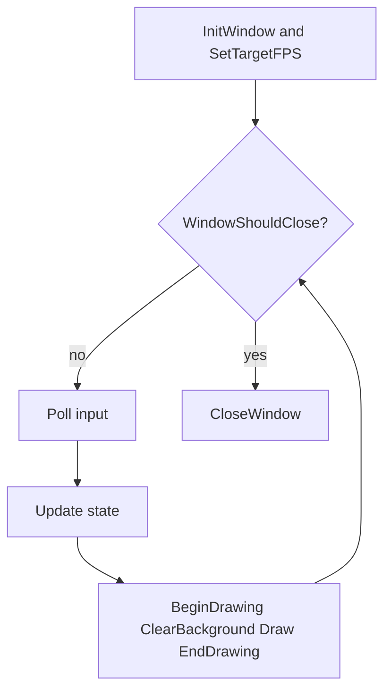

# Game Loop Plan

This is the main implementation plan for the basic Odin + raylib game loop. Read [00-overview.md](00-overview.md) for scope and done criteria, and [02-minimal-skeleton.md](02-minimal-skeleton.md) for annotated code shape.

## Package layout

Start with a single package at the repo root (or a dedicated `src/` later if the project grows):

```text
odin-demo/
├── README.md
├── docs/
│   ├── 00-overview.md
│   ├── 01-game-loop-plan.md
│   └── 02-minimal-skeleton.md
└── main.odin          # package main; entry point (to be added when implementing)
```

Keep the first version in one file. Split into `game.odin` / `render.odin` only after the loop is working and the file gets crowded.

Suggested imports in `main.odin`:

```odin
package main

import rl "vendor:raylib"
```

(Use the vendor import path that matches your Odin install if it differs slightly.)

## Core loop flow



## Phases

### 1. Init

- Call `rl.InitWindow(width, height, title)`.
- Register shutdown with `defer rl.CloseWindow()` immediately after init so cleanup always runs.
- Call `rl.SetTargetFPS(60)` (or another target) so the loop does not spin unbounded.
- Initialize any starting game state (even if that is just a position or counter).

### 2. Input

- Query keyboard/mouse **inside** the frame loop (`IsKeyDown`, `IsKeyPressed`, `GetMousePosition`, etc.).
- raylib polls OS events as part of its frame; you do not write a separate OS event pump for this basic setup.
- Prefer reading input into simple flags or values, then applying them in Update, so Input stays thin.

### 3. Update

- Mutate game state after input is read.
- For anything that should move smoothly across different frame rates, multiply by `dt := rl.GetFrameTime()` (seconds since last frame).
- For the absolute minimal demo (clear color only), Update can be empty.

### 4. Render

- Always bracket drawing with `rl.BeginDrawing()` / `rl.EndDrawing()`.
- Clear first with `rl.ClearBackground(...)`.
- Draw only between Begin/End. Do not update simulation inside the draw block unless you have a deliberate reason.

### 5. Shutdown

- `defer rl.CloseWindow()` (preferred) or an explicit call after the loop.
- Free any resources you allocate later (textures, sounds) before or as part of shutdown; the basic loop has none yet.

## Timing notes

| Approach | When to use |
| --- | --- |
| Frame-based (`SetTargetFPS` only) | First demo; logic that does not care about real time |
| `dt` via `GetFrameTime()` | Movement, timers, anything that should feel consistent if FPS dips |
| Fixed timestep + accumulator | Later upgrade for physics-heavy or deterministic simulation; **not** part of this basic plan |

For the first loop: set a target FPS, clear and draw each frame, optionally sample `GetFrameTime()` once you add motion.

## Implementation checklist

Do these in order when you leave docs and write code:

1. [ ] Confirm `odin version` works and raylib vendor is available.
2. [ ] Add `main.odin` with `package main` and `import rl "vendor:raylib"`.
3. [ ] Init window, `defer CloseWindow`, `SetTargetFPS`.
4. [ ] Write `for !rl.WindowShouldClose() { ... }` with Begin/Clear/End only.
5. [ ] Run with `odin run .` — verify window opens, clears, and closes via ESC/close button.
6. [ ] Add a trivial input check (e.g. change clear color while a key is held).
7. [ ] Add a trivial update using `GetFrameTime()` (e.g. move a drawn rectangle).
8. [ ] Stop. Do not add assets, scenes, or fixed timestep until the above feels solid.

## Later upgrades (explicitly deferred)

- Fixed timestep / accumulator
- SDL2 or GLFW instead of raylib
- Asset loading, audio, scenes, ECS, physics
- Multi-file package structure and build scripts
